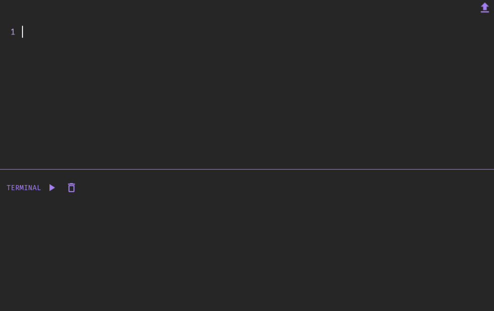

<h1 align="center"> Compiladores: Analisador SQL 👩🏻‍💻 </h1>

## ℹ️ Sobre o projeto

Este trabalho aborda o uso de um parser recursivo descendente desenvolvido em Python para analisar comandos da linguagem SQL. Essa abordagem utiliza técnicas como expressões regulares e árvores sintáticas para identificar a estrutura sintática correta dos comandos SQL fornecidos como entrada.

Desenvolvido para a disciplina de Compiladores na Universidade Federal do Piauí, 2023.1.

## :sparkles: Funcionalidades do projeto

<p align="center">
  
</p>

## :hammer: Tecnologias usadas

Neste projeto foram usadas as seguintes tecnologias:

> Framework [Flutter](https://flutter.dev/)

> Linguagem [Dart](https://dart.dev/)

## :arrow_forward: Como executar

Primeiro você deve [instalar flutter](https://docs.flutter.dev/get-started/install).

Então, você pode clocar e entrar na pasta do projeto:

```bash
git clone https://github.com/jhoisz/analisador_sql
cd analisador_sql
```

Agora, para testar, você deve instalar os pacotes/dependêncas e usar um dispositivo conectado ao seu computador ou usar um emulador:

```bash
Flutter pub get
flutter run
```
