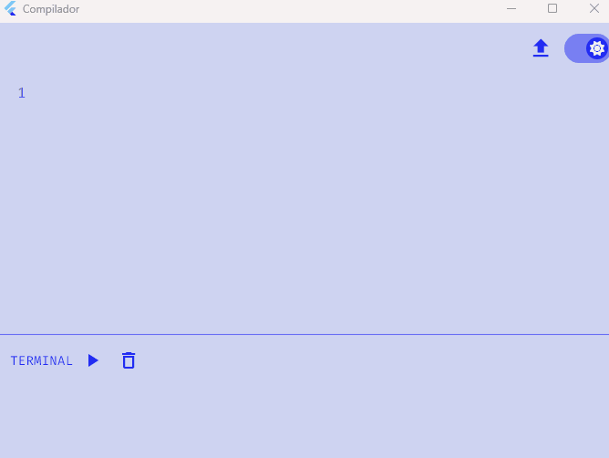

<h1 align="center"> Compilador ▶️ </h1>

## ℹ️ Sobre o projeto

Este trabalho apresenta um compilador para uma linguagem nova, utilizando uma API que converte o que é digitado em código Jasmin.

Desenvolvido para a disciplina de Compiladores na Universidade Federal do Piauí, 2023.1.

## ✨ Projeto

<p align="center">
  
</p>

## ⚒️ Tecnologias usadas

Neste projeto foram usadas as seguintes tecnologias:

> Framework [Flutter](https://flutter.dev/)

> Linguagem [Dart](https://dart.dev/)

## ▶️ Como executar

Primeiro você deve [instalar flutter](https://docs.flutter.dev/get-started/install).

Então, você pode clonar e entrar na pasta do projeto:

```bash
git clone https://github.com/jhoisz/compilador
cd compilador
```

Agora, para testar, você deve instalar os pacotes/dependências e usar um dispositivo conectado ao seu computador ou usar um emulador:

```bash
Flutter pub get
flutter run
```
